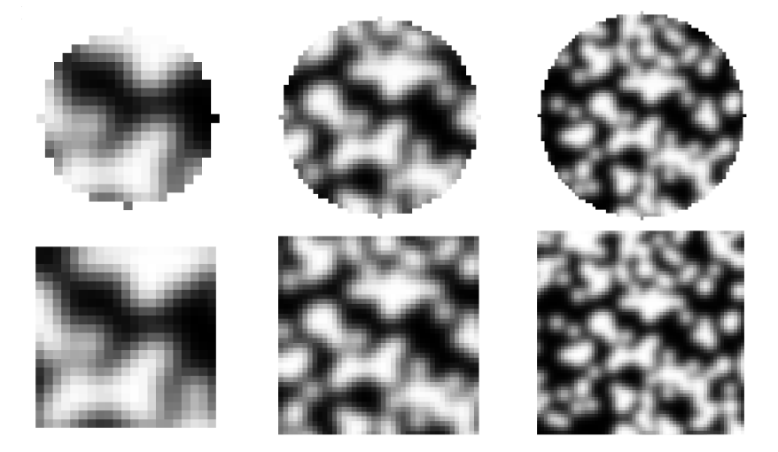

Theory
======

This section describes the theory that underpins the `geopyv` package.

Images
------
Digital images, consisting of pixel intensity arrays, are discrete representations of a continuous field. Therefore, image intensity interpolation is a necessary operation in all iterative local DIC algorithms. In `geopyv`, bi-quintic B-spline interpolation is adopted, which although computationally expensive, minimises bias errors (Schreier et al. 2000).

Computation of B-spline coefficients
~~~~~~~~~~~~~~~~~~~~~~~~~~~~~~~~~~~~

The B-spline coefficents are pre-computed for all images using recursive 1D deconvolution. The grayscale reference image :math:`f`, is first padded with a replicated border (default of 20 pixels) to create the padded reference image :math:`f_{p}` of size :math:`(i,j)` pixels. The quintic B-spline kernel :math:`\mathbf{b}` is:
    
.. math::
    
    \mathbf{k} = \begin{bmatrix} 1/120 &  13/60 & 11/20 & 13/60 & 1/120 & 0 \end{bmatrix}

A null vector :math:`\mathbf{b}_{x} = 0_{1,j}` is then created, into which the quintic B-spline kernel :math:`\mathbf{b}` is inserted as follows:
    
.. math::
    
    \mathbf{b}_{x\left( 0:3 \right)} = \mathbf{k}_{\left( 3:5 \right)} \text{ and } \mathbf{b}_{\left(j-3:j \right)} = \mathbf{k}_{\left( 0:3 \right)}
    
The Fast Fourier Transform (FFT) of this padded kernel vector is used to divide the FFT of the :math:`i`-th row of the padded grayscale image :math:`\mathbf{I}_{p}`, after which the inverse FFT is taken for each row:
    
.. math::
    
    \mathbf{C}_{\left( i, : \right)} = F^{-1}\left[ \frac{ F\left[ f_{p\left( i, : \right)} \right] }{ F\left[ \mathbf{b}_{x} \right] } \right]
    
where :math:`F` and :math:`F^{-1}` represent the FFT and inverse FFT, respectively. \
    
A second null vector :math:`\mathbf{b}_{y} = 0_{1,i}` is then created, into which the B-spline kernel is inserted as follows:

.. math::
    
    \mathbf{b}_{y \left( 0:3 \right)} = \mathbf{b}_{\left( 3:5 \right)} \text{ and } \mathbf{b}_{y \left( i-3:i \right)} = \mathbf{b}_{\left( 0:3 \right)}
    
The FFT of this padded kernel vector is used to divide the FFT of the :math:`j`-th column of the B-spline coefficient matrix :math:`\mathbf{C}`,
after which the inverse FFT is taken for each column to yield the final matrix of B-spline coefficients:

.. math::
    
    \mathbf{C}_{\left( :, j \right)} = F^{-1}\left[ \frac{ F\left[ \mathbf{C}_{\left( :, j \right)} \right] }{ F\left[ \mathbf{b}_{y} \right] } \right]

This array of coefficients is computed by :py:meth:`geopyv.image.Image._get_C`. The same technique is used to calculate the B-spline coefficients for the target image :math:`g`. 

.. warning::
    
    The padded image must be at least as large as the quintic B-spline kernel in order for this method to function correctly (i.e. i > 5, j > 5). 

Precomputation of interpolant array
~~~~~~~~~~~~~~~~~~~~~~~~~~~~~~~~~~~

The bi-quintic B-spline kernel :math:`\mathbf{Q}` is:
        
.. math::
    
    \mathbf{Q} = \begin{bmatrix}
                    1/120 &  13/60 & 11/20 & 13/60 & 1/120 &     0 \\
                    -1/24 &  -5/12 &      0 &  5/12 &  1/24 &     0 \\
                    1/12 &    1/6 &   -1/2 &   1/6 &  1/12 &     0 \\
                    -1/12 &    1/6 &      0 &  -1/6 &  1/12 &     0 \\
                    1/24 &   -1/6 &    1/4 &  -1/6 &  1/24 &     0 \\
                    -1/120 &   1/24 &  -1/12 & -1/12 & -1/24 & 1/120 
                    \end{bmatrix} 
                    
and :math:`\mathbf{Q}^T` is its transpose. 

The :math:`\mathbf{C}_\left(i-2:i+3, j-2:j+3\right)` matrix is a subset of the B-spline coefficient matrix :math:`\mathbf{C}` computed by :py:meth:`geopyv.image.Image._get_C`, where :math:`i` and :math:`j` are the image coordinates:
    
.. math::
    
    \mathbf{C}_\left(i-2:i+3, j-2:j+3\right) = \begin{bmatrix}
                    \mathbf{C}_\left(i-2,j-2 \right) &  \mathbf{C}_\left(i-1,j-2 \right) & \mathbf{C}_\left(i,j-2 \right) & \mathbf{C}_\left(i+1,j-2 \right) & \mathbf{C}_\left(i+2,j-2 \right) & \mathbf{C}_\left(i+3,j-2 \right) \\
                    \mathbf{C}_\left(i-2,j-1 \right) &  \mathbf{C}_\left(i-1,j-1 \right) & \mathbf{C}_\left(i,j-1 \right) & \mathbf{C}_\left(i+1,j-1 \right) & \mathbf{C}_\left(i+2,j-1 \right) & \mathbf{C}_\left(i+3,j-1 \right) \\
                    \mathbf{C}_\left(i-2,j \right)   &  \mathbf{C}_\left(i-1,j \right)   & \mathbf{C}_\left(i,j \right)   & \mathbf{C}_\left(i+1,j \right)   & \mathbf{C}_\left(i+2,j \right)   & \mathbf{C}_\left(i+3,j \right)   \\
                    \mathbf{C}_\left(i-2,j+1 \right) &  \mathbf{C}_\left(i-1,j+1 \right) & \mathbf{C}_\left(i,j+1 \right) & \mathbf{C}_\left(i+1,j+1 \right) & \mathbf{C}_\left(i+2,j+1 \right) & \mathbf{C}_\left(i+3,j+1 \right) \\
                    \mathbf{C}_\left(i-2,j+2 \right) &  \mathbf{C}_\left(i-1,j+2 \right) & \mathbf{C}_\left(i,j+2 \right) & \mathbf{C}_\left(i+1,j+2 \right) & \mathbf{C}_\left(i+2,j+2 \right) & \mathbf{C}_\left(i+3,j+2 \right) \\
                    \mathbf{C}_\left(i-2,j+3 \right) &  \mathbf{C}_\left(i-1,j+3 \right) & \mathbf{C}_\left(i,j+3 \right) & \mathbf{C}_\left(i+1,j+3 \right) & \mathbf{C}_\left(i+2,j+3 \right) & \mathbf{C}_\left(i+3,j+3 \right) 
                \end{bmatrix} 

The following matrix is pre-computed from these quantities for all pixels in the image by :py:meth:`geopyv.image.Image._get_QCQT`:

.. math::

    \mathbf{Q} \cdot \mathbf{C}_{\left(\left\lfloor x \right\rfloor-2:\left\lfloor x \right\rfloor+3, \left\lfloor y \right\rfloor-2:\left\lfloor y \right\rfloor+3\right)} \cdot \mathbf{Q}^T

.. note::
    
    This pre-computation - although computationally efficient when used in repeated image intensity interpolation - requires a significant amount of memory, particularly for large images.

Image intensity interpolation
~~~~~~~~~~~~~~~~~~~~~~~~~~~~~

In general, the intensity of arbitrary image coordinates are estimated using bi-quintic B-spline image intensity interpolation. First, the sub-pixel component of the position of each point in the subset is computed as follows from the current coordinates:

.. math::

    \begin{array}{c}
    \delta x=x-\lfloor x\rfloor \\
    \delta y=y-\lfloor y\rfloor
    \end{array}

where :math:`\lfloor x\rfloor` and :math:`\lfloor y\rfloor` are the floor of the coordinates :math:`x` and :math:`y`. The interpolated pixel intensity at the current sub-pixel coordinate :math:`(x, y)` in the reference image :math:`f`, defined as :math:`f(x, y)`, is then calculated by performing the following operation:

.. math::

    f(x, y)=\left[\begin{array}{llllll}
    1 & \delta y & \delta y^{2} & \delta y^{3} & \delta y^{4} & \delta y^{5}
    \end{array}\right] \cdot \mathbf{Q} \cdot \mathbf{C}_{f(\lfloor x\rfloor-2:\lfloor x\rfloor+3,\lfloor y\rfloor-2:\lfloor y\rfloor+3)} \cdot \mathbf{Q}^T \cdot\left[\begin{array}{c}
    1 \\
    \delta x \\
    \delta x^{2} \\
    \delta x^{3} \\
    \delta x^{4} \\
    \delta x^{5}
    \end{array}\right]

where :math:`\mathbf{Q} \cdot \mathbf{C}_{f} \cdot \mathbf{Q}^T` is precomputed for the entirety of image :math:`f` by :py:meth:`geopyv.image.Image._get_QCQT`. The same method is used to interpolate pixel intensitites for both the reference image :math:`f` and the target image :math:`g`.

Subsets
-------
A subset is a small region within an image defined via a coordinate and a template. Localised warp between an image pair is considered by applying warp to a subset iteratively according to a particular PIV algorithm. 

Templates
~~~~~~~~~
Templates are defined by size and shape. In `geopyv` templates can be square or circular. Here are some examples:

The size of subset determines the data quantity and the scale of warp phenomena observed.  

.. image:: images/subset_trends.png
  :width: 600
  :align: center

Shape Functions
~~~~~~~~~~~~~~~

The zeroth-order subset warp function is the simplest warp function, that is only used in `geopyv` for the initial guess in the higher order warp function based methods:

.. math::

    \mathbf{W}_{\mathbf{0}}\left(x, y ; \mathbf{p}_{1}\right) = \left[\begin{array}{l}
    x^{\prime} \\
    y^{\prime}
    \end{array}\right] = \left[\begin{array}{ccc}
    x \\
    y
    \end{array}\right] + \left[\begin{array}{l}
    u \\
    v
    \end{array}\right]

The warp parameter vector for a zeroth-order warp function is then:

.. math::

    \mathbf{p}_{0}=\left(u, v\right)^{T}

Displacement gradients are added to generate a first-order subset warp function:

.. math::

    \mathbf{W}_{\mathbf{1}}\left(x, y ; \mathbf{p}_{1}\right) = \left[\begin{array}{l}
    x^{\prime} \\
    y^{\prime}
    \end{array}\right] = \left[\begin{array}{l}
    x \\
    y
    \end{array}\right] + \left[\begin{array}{ccc}
    u_{x} & u_{y} & u \\
    v_{x} & v_{y} & v
    \end{array}\right]\left[\begin{array}{l}
    \Delta x \\
    \Delta y \\
    1
    \end{array}\right]

where :math:`\Delta x = (x - x_{c})` and :math:`\Delta  y = (y - y_{c})` are the local coordinates where :math:`(x_{c}, y_{c})` are the coordinates of the centre of the subset and :math:`(x, y)` are the coordinates of the point of interest. The corresponding warp parameter vector is:

.. math::

    \mathbf{p}_{1}=\left(u, v, u_{x}, v_{x}, u_{y}, v_{y}\right)^{T}

Higher order terms are added to generate the second-order subset warp function:

.. math::

    \mathbf{W}_{2}\left(x, y ; \mathbf{p}_{2}\right) = \left[\begin{array}{l}
    x^{\prime} \\
    y^{\prime}
    \end{array}\right] = \left[\begin{array}{l}
    x \\
    y
    \end{array}\right] + \left[\begin{array}{cccccc}
    \frac{1}{2} u_{x x} & u_{x y} & \frac{1}{2} u_{y y} & u_{x} & u_{y} & u \\
    \frac{1}{2} v_{x x} & v_{x y} & \frac{1}{2} v_{y y} & v_{x} & v_{y} & v
    \end{array}\right]\left[\begin{array}{c}
    \Delta x^{2} \\
    \Delta x \Delta y \\
    \Delta y^{2} \\
    \Delta x \\
    \Delta y \\
    1
    \end{array}\right]

for which the warp parameter vector is:

.. math::

    \mathbf{p}_{2}=\left(u, v, u_{x}, v_{x}, u_{y}, v_{y}, u_{x x}, v_{x x}, u_{x y}, v_{x y}, u_{y y}, v_{y y}\right)^{T}

Throughout the remainder of this documentation :math:`f(\mathbf{W}{(x, y; \mathbf{p})})` represents the intensity of the coordinate :math:`(x, y)` in the image :math:`f` when a warp function :math:`\mathbf{W}` is applied, with parameters defined by the warp parameter vector :math:`\mathbf{p}`.

Sum of Square of Subset Intensity Gradients (SSSIG)
~~~~~~~~~~~~~~~~~~~~~~~~~~~~~~~~~~~~~~~~~~~~~~~~~~~

The Sum of Square of Subset Intensity Gradients (SSSIG) is a subset texture quality measure proposed by Pan et al. (2008) that is derived from the image gradients:

.. math::

    \nabla f = \left( \nabla f_{x}, \nabla f_{y} \right)

The directional gradients :math:`\nabla f_{x}` and :math:`\nabla f_{y}` can be computed by taking the partial derivatives of the function used to perform image intensity interpolation, which is the equivalent of performing the following multiplications using the :math:`\mathbf{Q} \cdot \mathbf{C} \cdot \mathbf{Q}^T` matrix:

.. math::

    \nabla f_{x} = \left[\begin{array}{llllll}
    1 & \delta y & \delta y^2 & \delta y^3 & \delta y^4 & \delta y^5
    \end{array}\right] \cdot \mathbf{Q} \cdot \mathbf{C}_{n(\lfloor x\rfloor-2:\lfloor x\rfloor+3,\lfloor y\rfloor-2:\lfloor y\rfloor+3)} \cdot \mathbf{Q}^{\mathbf{T}} \cdot\left[\begin{array}{c}
    0 \\
    1 \\
    0 \\
    0 \\
    0 \\
    0 \\
    \end{array}\right]

.. math::

    \nabla f_{y} = \left[\begin{array}{llllll}
    0 & 1 & 0 & 0 & 0 & 0
    \end{array}\right] \cdot \mathbf{Q} \cdot \mathbf{C}_{n(\lfloor x\rfloor-2:\lfloor x\rfloor+3,\lfloor y\rfloor-2:\lfloor y\rfloor+3)} \cdot \mathbf{Q}^{\mathbf{T}} \cdot\left[\begin{array}{c}
    1 \\
    \delta x \\
    \delta x^2 \\
    \delta x^3 \\
    \delta x^4 \\
    \delta x^5 \\
    \end{array}\right]

In this implementation an estimate of :math:`SSSIG` is computed by averaging the horizontal and vertical image intensity gradients:
    
.. math::
    
    SSSIG \approx \sum_{(x, y) \in n} \frac{1}{2}\left[\left(\nabla f_{x}\right)^{2}+\left(\nabla f_{y}\right)^{2}\right]

where :math:`n` is the set of coordinates that comprise the subset.

.. note::
            
    Values of :math:`SSSIG > 1 \cdot 10^5` are indicative of sufficient subset size and contrast according to Stanier et al. (2016).

Standard deviation of subset pixel intensities
~~~~~~~~~~~~~~~~~~~~~~~~~~~~~~~~~~~~~~~~~~~~~~

The standard deviation of the subset pixel intensities, :math:`\sigma_{s}`, after Stanier and White (2013), is calculated as follows:
            
.. math::
    
    \sigma_{s} = \sqrt{\sum_{(x, y) \in n} \frac{\left(f(\mathbf{W}(x, y; \mathbf{0}))-\bar{f}\right)^{2}}{|n|}}

where :math:`f{(\mathbf{W}(x, y; \mathbf{0}))}` is the intensity of the coordinate :math:`(x, y)` after application of a null warp function for each of the set of :math:`n` coordinates that comprise the subset, and :math:`\bar{f}` is the mean subset pixel intensity:

.. math::
    
    \bar{f} = \sum_{(x, y) \in n} \frac{f(\mathbf{W}(x, y; \mathbf{0}))}{|n|}\\

.. note::
    
    Values of :math:`\sigma_{s} > 15` are indicative of optimal seeding according to Stanier et al. (2016).

Correlation coefficient
-----------------------
The Normalised Cross-Correlation (NCC) criteria :math:`C_{NCC}` is defined as:
           
.. math::
    
    C_{NCC} = \frac{\sum_{(x, y) \in n} \left( f{(\mathbf{W}(x, y; \mathbf{0}))} \cdot g{(\mathbf{W}(x, y; \mathbf{p}))} \right)}{\sqrt{\sum_{(x, y) \in n} f{(\mathbf{W}(x, y; \mathbf{0}))}^{2} \cdot \sum_{(x, y) \in n} g{(\mathbf{W}(x, y; \mathbf{p}))}^{2}}}

where :math:`f_{(x, y; \mathbf{0})}` and :math:`g_{(x, y; \mathbf{p})}` are the image intensity at the coordinate :math:`(x,y)` for the reference subset and the target subset after application of a warp function :math:`\mathbf{W}` with deformation parameters as defined by the vector :math:`\mathbf{p}`. Values of :math:`C_{NCC}` fall in the range of 0 (no correlation) to 1 (perfect correlation).

The Normalised Cross-Correlation coefficient :math:`C_{NCC}` is computationally expensive to determine and sensitive to mean changes in image brightness. The zero-normalised sum of squared differences :math:`C_{ZNSSD}` is more robust to mean changes in image brightness and is considerably cheaper to compute. It is defined as follows:
            
.. math::

    C_{ZNSSD} = \sum_{(x, y) \in n} \left[ \frac{f{(\mathbf{W}(x, y; \mathbf{0}))}-\bar{f}}{\Delta f} - \frac{g{(\mathbf{W}(x, y; \mathbf{p}))}-\bar{g}}{\Delta g} \right]^2

where :math:`f{(\mathbf{W}(x, y; \mathbf{0}))}` and :math:`g{(\mathbf{W}(x, y; \mathbf{p}))}` are the image intensity in the reference image :math:`f` and the target image :math:`g`, for a coordinate :math:`(x, y)` in the set of :math:`n` coordinates that comprise the subset, when the warp function :math:`\mathbf{W}` is applied with deformation parameters as defined by the vector :math:`\mathbf{p}`. The quantities :math:`\bar{f}` and :math:`\bar{g}`, are the mean subset pixel intensities:
            
.. math::

    \bar{f} = \sum_{(x, y) \in n} \frac{f{(\mathbf{W}(x, y; \mathbf{0}))}}{|n|}\\
    \bar{g} = \sum_{(x^{\prime}, y^{\prime}) \in n} \frac{g{(\mathbf{W}(x, y; \mathbf{p}))}}{|n|}

The quantities :math:`\Delta f` and :math:`\Delta g` are calculated as follows:
            
.. math:: 
    
    \Delta f = \sqrt{ \sum_{(x, y) \in n} \left( f{(\mathbf{W}(x, y; \mathbf{0}))} - \bar{f} \right)^2}\\
    \Delta g = \sqrt{ \sum_{(x, y) \in n} \left( g{(\mathbf{W}(x, y; \mathbf{p}))} - \bar{g} \right)^2}

Values for the zero-normalised sum of squared differences :math:`C_{ZNSSD}` fall in the range of 2 (no correlation) to 0 (perfect correlation). The zero-normalised cross-correlation coefficient :math:`C_{ZNCC}` can be determined from the zero-normalised sum of squared differences :math:`C_{ZNSSD}` as follows:

.. math::
    
    C_{ZNCC} = 1 - \left( \frac{C_{ZNSSD}}{2} \right)

as proven analytically by Pan et al. (2010). The values of the zero-normalised cross-correlation coefficient :math:`C_{ZNCC}` fall in the range of 0 (no correlation) to 1 (perfect correlation).

Initial guess
-------------
      
The initial guess subset size is a square of side length :math:`s` such that:
    
.. math::
    
    s = \sqrt{n}
    
where :math:`n` is the set of pixels that comprise the subset template. The position of the subset in the target image is computed to the nearest ineteger pixel using the Normalised Cross-Correlation (NCC) criteria, :math:`C_{NCC}`. The initial guess method is a zero'th order technique (i.e. rigid body translation), therefore the difference between the reference subset coordinates :math:`(x, y)` and the target subset coordinates :math:`(x^{\prime}, y^{\prime})` that produces the maximum value of :math:`C_{NCC}` denotes the initial guess of the warp function parameters :math:`u` and :math:`v`.

Iterative Solution Methods
--------------------------

Inverse Compositional Gauss-Newton (ICGN) Method
~~~~~~~~~~~~~~~~~~~~~~~~~~~~~~~~~~~~~~~~~~~~~~~~

The Inverse Compositional Gauss-Newton method is the default approach used in `geopyv`, primarily because the majority of computational operations are performed on the reference subset, remain constant through the iterative solution process, and so can be precomputed. The incremental warp :math:`\Delta \mathbf{p}` is applied to the reference subset, hence the Zero Normalised Sum of Square Differences (ZNSSD) correlation coefficient can be defined as:

.. math::

    C_{ZNSSD}(\Delta \mathbf{p}) = \sum_{(x, y) \in n} \left[ \frac{f{(\mathbf{W}(x, y; \Delta \mathbf{p}))}-\bar{f}}{\Delta f} - \frac{g{(\mathbf{W}(x, y; \mathbf{p}))}-\bar{g}}{\Delta g} \right]^2

A first-order Taylor series expansion yields:

.. math::
    
    C_{ZNSSD}(\Delta \mathbf{p}) = \sum_{(x, y) \in n} \left[\frac{f(\mathbf{W}(x, y ; 0))+\nabla f(\frac{\partial \mathbf{W}}{\partial \mathbf{p}}) \Delta \mathbf{p}-\bar{f}}{\Delta f}-\frac{g(\mathbf{W}(x, y ; \mathbf{p}))-\bar{g}}{\Delta g}\right]^{2}
    
where :math:`\nabla f` is the intensity gradient in the :math:`x` and :math:`y` directions:

.. math::

    \nabla f = \left( \nabla f_{x}, \nabla f_{y} \right)

where :math:`\nabla f_{x}` and :math:`\nabla f_{y}` are approximated using bi-quintic B-spline image intensity interpolation as outlined previously, :math:`\frac{\partial \mathbf{W}}{\partial \mathbf{p}}` is the Jacobian of the warp function, and :math:`\Delta f` and :math:`\Delta g` are also as previously defined. The products of the image gradients and the Jacobian matrix are often referred to as the `steepest descent images`. For a first order subset:

.. math::

    \frac{\partial \mathbf{W}_{1}}{\partial \mathbf{p}_{1}}=\left[\begin{array}{llllll}
    1 & 0 & \Delta x & 0 & \Delta x & 0 \\
    0 & 1 & 0 & \Delta y & 0 & \Delta y
    \end{array}\right]

For a second order subset:

.. math::

    \frac{\partial \mathbf{W}_{2}}{\partial \mathbf{p}_{2}}=\left[\begin{array}{cccccccccccc}
    1 & 0 & \Delta x & 0 & \Delta x & 0 & \frac{1}{2} \Delta x^{2} & 0 & \Delta x \Delta y & 0 & \frac{1}{2} \Delta y^{2} & 0 \\
    0 & 1 & 0 & \Delta y & 0 & \Delta y & 0 & \frac{1}{2} \Delta x^{2} & 0 & \Delta x \Delta y & 0 & \frac{1}{2} \Delta y^{2} 
    \end{array}\right]

The magnitude of :math:`\Delta \mathbf{p}` can then be solved via the least squares method:

.. math::

    \Delta \mathbf{p}=-\mathbf{H}^{-1} \sum_{(x, y) \in n} \left\{\left[\nabla f\left(\frac{\partial \mathbf{W}}{\partial \mathbf{p}}\right)\right]^{T}\left[f(\mathbf{W}(x, y ; 0))-\bar{f} - \frac{\Delta f}{\Delta g} (g(\mathbf{W}(x, y ; \mathbf{p}))-\bar{g})\right]\right\}

where :math:`\mathbf{H}` is (the Gauss-Newton approximation to) the Hessian matrix:

.. math::

    \mathbf{H} = \sum_{(x, y) \in n}  \left\{\left[\nabla f\left(\frac{\partial \mathbf{W}}{\partial \mathbf{p}}\right)\right]^{T}\left[\nabla f\left(\frac{\partial \mathbf{W}}{\partial \mathbf{p}}\right)\right]\right\}

In the ICGN method, the Hessian matrix :math:`\mathbf{H}` is constant because the intensity gradient :math:`\nabla f` and Jacobian of the warp function :math:`\frac{\partial \mathbf{W}}{\partial \mathbf{p}}` are independent of the target subset. The updated warp function is then computed as follows:

.. math::

    \mathbf{W}(x, y ; \mathbf{p}) \leftarrow \mathbf{W}(x, y ; \mathbf{p}) \circ \mathbf{W}^{-1}(x, y ; \Delta \mathbf{p})

Since the warp function :math:`\mathbf{W}` must be inverted in order to solve :math:`\Delta \mathbf{p}`, the warp functions must be converted to a homogenous form. The expanded first-order homogenous form is trivial:

.. math::

    \mathbf{W}_{\mathbf{1}}\left(x, y ; \mathbf{p}_{1}\right)=\left[\begin{array}{ccc}
    1+u_{x} & u_{y} & u \\
    v_{x} & 1+v_{y} & v \\
    0 & 0 & 1
    \end{array}\right]

The expanded second-order homogenous form requires additional terms, which were derived by Gao et al. (2015):

.. math::

    \mathbf{W}_{\mathbf{2}}\left(x, y ; \mathbf{p}_{2}\right)=\left[\begin{array}{cccccc}
    1+S_{1} & S_{2} & S_{3} & S_{4} & S_{5} & S_{6} \\
    S_{7} & 1+S_{8} & S_{9} & S_{10} & S_{11} & S_{12} \\
    S_{13} & S_{14} & 1+S_{15} & S_{16} & S_{17} & S_{18} \\
    \frac{1}{2} u_{x x} & u_{x y} & \frac{1}{2} u_{y y} & 1+u_{x} & u_{y} & u \\
    \frac{1}{2} v_{x x} & v_{x y} & \frac{1}{2} v_{y y} & v_{x} & 1+v_{y} & v \\
    0 & 0 & 0 & 0 & 0 & 1
    \end{array}\right]

where:

.. math:: 

    \begin{array}{ll}
    S_{1}=2 u_{x}+u_{x}^{2}+u u_{x x} & S_{2}=2 u u_{x y}+2\left(1+u_{x}\right) u_{y} \\
    S_{3}=u_{y}^{2}+u u_{y y} & S_{4}=2 u\left(1+u_{x}\right) \\
    S_{5}=2 u u_{y} & S_{6}=u^{2} \\
    S_{7}=\frac{1}{2}\left[v u_{x x}+2\left(1+u_{x}\right) v_{x}+u v_{x x}\right] & S_{8}=u_{y} v_{x}+u_{x} v_{y}+v u_{x y}+u v_{x y}+v_{y}+u_{x} \\
    S_{9}=\frac{1}{2}\left[v u_{y y}+2 u_{y}\left(1+v_{y}\right)+u v_{y y}\right] & S_{10}=v+v u_{x}+u v_{x} \\
    S_{11}=u+v u_{y}+u v_{y} & S_{12}=u v \\
    S_{13}=v_{x}^{2}+v v_{x x} & S_{14}=2 v v_{x y}+2 v_{x}\left(1+v_{y}\right) \\
    S_{15}=2 v_{y}+v_{y}^{2}+v v_{y y} & S_{16}=2 v v_{x} \\
    S_{17}=2 v\left(1+v_{y}\right) & S_{18}=v^{2}
    \end{array}

Forward Additive Gauss-Newton (FAGN) Method
~~~~~~~~~~~~~~~~~~~~~~~~~~~~~~~~~~~~~~~~~~~

The Forward Additive Gauss-Newton method is an alternative approach used in `geopyv`. It is a classical approach in DIC, but is not the default here primarily because the majority of computational operations are performed on the target subset, such that they require recallculation for every iteration. This is computationally far more expensive than the ICGN approach, but in all other ways the approaches are effectively equivalent. The incremental warp :math:`\Delta \mathbf{p}` is applied to the target subset, hence the Zero Normalised Sum of Square Differences (ZNSSD) correlation coefficient can be defined as:

.. math::

    C_{ZNSSD}(\Delta \mathbf{p}) = \sum_{(x, y) \in n} \left[ \frac{f{(\mathbf{W}(x, y; \mathbf{0}))}-\bar{f}}{\Delta f} - \frac{g{(\mathbf{W}(x, y; \mathbf{p} + \Delta \mathbf{p}))}-\bar{g}}{\Delta g} \right]^2

A first-order Taylor series expansion yields:

.. math::
    
    C_{ZNSSD}(\Delta \mathbf{p}) = \sum_{(x, y) \in n} \left[\frac{f(\mathbf{W}(x, y ; \mathbf{0}))-\bar{f}}{\Delta f} - \frac{g(\mathbf{W}(x, y ; \mathbf{p}))+\nabla g\left(\frac{\partial \mathbf{W}}{\partial \mathbf{p}}\right) \Delta \mathbf{p}-\bar{g}}{\Delta g}\right]^{2}
    
where :math:`\nabla g` is the intensity gradient in the :math:`x` and :math:`y` directions:

.. math::

    \nabla g = \left( \nabla g_{x}, \nabla g_{y} \right)

where :math:`\nabla g_{x}` and :math:`\nabla g_{y}` are approximated using bi-quintic B-spline image intensity interpolation as outlined previously, :math:`\frac{\partial \mathbf{W}}{\partial \mathbf{p}}` is the Jacobian of the warp function, and :math:`\Delta f` and :math:`\Delta g` are also as previously defined. The products of the image gradients and the Jacobian matrix are often referred to as the `steepest descent images`. For a first order subset:

.. math::

    \frac{\partial \mathbf{W}_{1}}{\partial \mathbf{p}_{1}}=\left[\begin{array}{llllll}
    1 & 0 & \Delta x & 0 & \Delta x & 0 \\
    0 & 1 & 0 & \Delta y & 0 & \Delta y
    \end{array}\right]

For a second order subset:

.. math::

    \frac{\partial \mathbf{W}_{2}}{\partial \mathbf{p}_{2}}=\left[\begin{array}{cccccccccccc}
    1 & 0 & \Delta x & 0 & \Delta x & 0 & \frac{1}{2} \Delta x^{2} & 0 & \Delta x \Delta y & 0 & \frac{1}{2} \Delta y^{2} & 0 \\
    0 & 1 & 0 & \Delta y & 0 & \Delta y & 0 & \frac{1}{2} \Delta x^{2} & 0 & \Delta x \Delta y & 0 & \frac{1}{2} \Delta y^{2} 
    \end{array}\right]

The magnitude of :math:`\Delta \mathbf{p}` can then be solved via the least squares method:

.. math::

    \Delta \mathbf{p}=-\mathbf{H}^{-1} \sum_{(x, y) \in n} \left\{\left[\nabla g\left(\frac{\partial \mathbf{W}}{\partial \mathbf{p}}\right)\right]^{T}\left[ (f(\mathbf{W}(x, y ; 0))-\bar{f}) \frac{\Delta g}{\Delta f} - g(\mathbf{W}(x, y ; \mathbf{p}))-\bar{g}\right]\right\}

where :math:`\mathbf{H}` is (the Gauss-Newton approximation to) the Hessian matrix:

.. math::

    \mathbf{H} = \sum_{(x, y) \in n}  \left\{\left[\nabla g\left(\frac{\partial \mathbf{W}}{\partial \mathbf{p}}\right)\right]^{T}\left[\nabla g\left(\frac{\partial \mathbf{W}}{\partial \mathbf{p}}\right)\right]\right\}

Finally, the warp parameter vector is updated as follows:

.. math::

    \mathbf{p} \leftarrow \mathbf{p} + \Delta \mathbf{p}

.. Weighted Forward Additive Gauss-Newton (WFAGN) Method
.. ~~~~~~~~~~~~~~~~~~~~~~~~~~~~~~~~~~~~~~~~~~~~~~~~~~~~~

.. The Weighted Forward Additive Gauss-Newton approach uses a Gaussian window function in order to adaptively vary the effective subset size across an analysis domain. This allow larger subsets to be used without risk of under-matching (where the warp function is a lower order than the deformation). The penalty is that this method is much more computationally intensive because the tricks employed in the ICGN method cannot be used. This is because the Jacobian and Hessian are both a function of a the Gaussian window size, which is a variable in the least squares optimsiation in this approach. For this reason a more expansive derivation will be given for this method using slightly more verbose nomenclature. For the WFAGN method the correlation coefficient is defined as:

.. .. math::

..     C_{W}(\Delta \mathbf{p}) = \sum_{(x, y) \in n} \frac{T(\mathbf{p})^2}{A_{s}}

.. where:

.. .. math::

..     T(\mathbf{p}) = g_{n}W_{g} - f_{n}W_{f}

.. and the scalar :math:`A_{s}` is computed as:

.. .. math::

..     A_{s} = \sum_{(x, y) \in n} W_{f}^2

.. The :math:`g_{n}` and :math:`f_{n}` terms are the normalised intensities, given by: 

.. .. math::

..     g_{n} = \frac{g{(\mathbf{W}(x, y; \mathbf{p}))}-\bar{g}}{\Delta g} \quad \text{and} \quad
..     f_{n} = \frac{f{(\mathbf{W}(x, y; \mathbf{0}))}-\bar{f}}{\Delta f}

.. This is very similar to that for the FAGN method, except that the normalised intensities in the target and reference subsets are multiplied by :math:`W_{g}` and :math:`W_{f}`, respectively, and their difference (also known as the error image) is divided by the sum of the square the of the reference weighting coefficients. The weighting coefficients are computed using a form of Gaussian function for the reference and target subsets respectively:

.. .. math::

..     W_{g} = \exp \left( {-\frac{D_{g}^{2}}{2D_{0}^2}} \right) \quad \text{and} \quad W_{f} = \exp \left( {-\frac{D_{f}^2}{2D_{0}^2}} \right)

.. where :math:`D_{0}` is an additional variable to be optimised, and :math:`D_{g}` and :math:`D_{f}` are the distances from the centre coordinate of the subset to the current point in the target and reference subsets, respectively:

.. .. math::
    
..     D_{g} = \sqrt{\Delta x^{\prime 2} + \Delta y^{\prime 2}} \quad \text{and} \quad D_{f} = \sqrt{\Delta x^2 + \Delta y^2}

.. where :math:`\Delta x^{\prime}` and :math:`\Delta y^{\prime}` and :math:`\Delta x` and :math:`\Delta y` are the local coordinates of the points of interest in the target and reference images, respectively:

.. .. math::
        
..     \Delta x^{\prime} = (x^{\prime} - x_{c}^{\prime}); \quad \Delta y^{\prime} = (y^{\prime} - y_{c}^{\prime}) \quad \text{and} \quad \Delta x = (x - x_{c}); \quad \Delta y = (y - y_{c})

.. given :math:`(x_{c}, y_{c})` and :math:`(x_{c}^{\prime}, y_{c}^{\prime})` are the centre coordinates for the subset in the reference and target image, respectively. The parameter :math:`D_{0}` is appended to the warp parameter vector :math:`\mathbf{p}`, such that an appopriate value is determined via optimisation for each subset. For a first-order warp function the warp parameter vector becomes:

.. .. math::

..     \mathbf{p}_{1W} = \left(u, v, u_{x}, v_{x}, u_{y}, v_{y}, D_{0}\right)^{T}

.. and for a second-order warp function:

.. .. math::

..     \mathbf{p}_{2W} = \left(u, v, u_{x}, v_{x}, u_{y}, v_{y}, u_{x x}, v_{x x}, u_{x y}, v_{x y}, u_{y y}, v_{y y}, D_{0}\right)^{T}

.. where the subscript :math:`W` represents the addition of the Gaussian window parameter :math:`D_{0}`. For clarity, the warp parameter vector :math:`\mathbf{p}`  herein refers to the weighted versions given above. 

.. The increment in the warp parameter vector :math:`\mathbf{p}` is approximated as:

.. .. math:: 

..     \Delta \mathbf{p} = -\mathbf{H}^{-1} \nabla C_{W}

.. where the gradient of :math:`C_{W}` with respect to :math:`\mathbf{p}` is:

.. .. math::

..     \nabla C_{W}(\mathbf{p}) = \frac{1}{A_{s}^2} \sum_{(x, y) \in n} \left[2A_{s} T(\mathbf{p}) \frac{\partial T(\mathbf{p})}{\partial \mathbf{p}} - T(\mathbf{p})^2 \frac{\partial A_{s}}{\partial \mathbf{p}} \right]

.. For the all but the last term in the expanded warp parameter vector :math:`\mathbf{p}`, the derivatives :math:`\left. \frac{\partial A_{s}}{\partial \mathbf{p}} \right|_{i=1,2, \ldots k-1}` are zero because this quantity is not a function of :math:`\mathbf{p}`, hence:

.. .. math::

..      \left. \frac{\partial C_{W}(\mathbf{p})}{\partial p_{i}} \right|_{i=1,2, \ldots k-1} = \frac{2}{A_s} \sum_{(x, y) \in n} \left. \left[ T(\mathbf{p}) \frac{\partial T(\mathbf{p})}{\partial \mathbf{p}} \right] \right|_{i=1,2, \ldots k-1}

.. where for all but the last term in the warp parameter vector (referred to here as the :math:`k`'th term for generality, where :math:`k=7` for a first-order warp function and :math:`k=13` for a second-order warp function):

.. .. math::

..     \left.\frac{\partial T(\mathbf{p})}{\partial p_{i}}\right|_{i=1,2, \ldots k-1} = \left.\left[W_{g} \frac{\partial g_{n}}{\partial p_{i}} + g_{n} \frac{\partial W_{g}}{\partial p_{i}}\right]\right|_{i=1,2, \ldots k-1}

.. given:

.. .. math:: 

..     \left.\frac{\partial g_{n}}{\partial p_{i}}\right|_{i=1,2, \ldots k-1} = \left.\frac{1}{\Delta g^2} \left[ \Delta g \left(\frac{\partial g}{\partial p_{i}} - \frac{\partial \bar{g}}{\partial p_{i}}\right) - \left(g{(\mathbf{W}(x, y; \mathbf{p}))} - g_{m}\right) \frac{\partial \Delta g}{\partial p_{i}} \right]\right|_{i=1,2, \ldots k-1} \\

.. and:

.. .. math::

..     \left.\frac{\partial \bar{g}}{\partial p_{i}}\right|_{i=1,2, \ldots k-1} = \frac{1}{n} \left.\left[\sum_{(x, y) \in n} \frac{\partial g}{\partial p_{i}}\right]\right|_{i=1,2, \ldots k-1} \\

.. The derivatives :math:`\left.\frac{\partial g}{\partial p_{i}}\right|_{i=1,2, \ldots k-1}` are the 'steepest descent images', which are a function of the target image gradients :math:`\nabla g` and the Jacobian matrix :math:`\frac{\partial \mathbf{W}}{\partial \mathbf{p}}`:

.. .. math::

..     \left.\frac{\partial g}{\partial p_{i}}\right|_{i=1,2, \ldots k-1} = \nabla g \frac{\partial \mathbf{W}}{\partial \mathbf{p}}

.. where the gradient and Jacobian matrices are as defined previously. The derivatives :math:`\left.\frac{\partial W_{g}}{\partial p_{i}}\right|_{i=1,2, \ldots k-1}` are computed from the warp functions as follows:

.. .. math::

..     \begin{align}
..         \frac{\partial W_{g}}{\partial p_{1}} = \frac{\partial W_{g}}{\partial u} &= 0 \\
..         \frac{\partial W_{g}}{\partial p_{2}} = \frac{\partial W_{g}}{\partial v} &= 0 \\
..         \frac{\partial W_{g}}{\partial p_{3}} = \frac{\partial W_{g}}{\partial u_{x}} &= -\frac{W_{g}}{2D_{0}^2} \left[\left(1 + u_{x}\right) \Delta x + u_{y} \Delta y \right] \Delta x \\
..         \frac{\partial W_{g}}{\partial p_{4}} = \frac{\partial W_{g}}{\partial v_{v}} &= -\frac{W_{g}}{2D_{0}^2} \left[v_{x} \Delta x + \left(1 + v_{y}\right) \Delta y \right] \Delta x \\
..         \frac{\partial W_{g}}{\partial p_{5}} = \frac{\partial W_{g}}{\partial u_{y}} &= -\frac{W_{g}}{2D_{0}^2} \left[\left(1 + u_{x}\right) \Delta x + u_{y} \Delta y \right] \Delta y \\
..         \frac{\partial W_{g}}{\partial p_{6}} = \frac{\partial W_{g}}{\partial v_{y}} &= -\frac{W_{g}}{2D_{0}^2} \left[v_{x} \Delta x + \left(1 + v_{y}\right) \Delta y \right] \Delta y \\
..     \end{align}

.. DERIVE HIGHER ORDER TERMS NEXT...

.. For the last component of :math:`\mathbf{p}` the gradient term :math:`\frac{\partial C(\mathbf{p})}{\partial p_{k}}` is:

.. .. math::

..      \frac{\partial C_{W}(\mathbf{p})}{\partial p_{k}} = \frac{1}{A_s^2} \sum_{(x, y) \in n} \left[ T(\mathbf{p}) \left( \frac{g_{n} W_{g} D^{\prime 2}}{D_{0}^3} - \frac{g_{f} W_{f} D^{2}}{D_{0}^3} \right) - \frac{T(\mathbf{p})^2}{A_{s}} \frac{\partial A_{s}}{\partial p_{k}} \right]

.. Both of the weighting coefficients :math:`W_{g}` and :math:`W_{f}` are functions of the parameter :math:`D_{0}`, thus we must calculate both:

.. .. math::

..     \frac{\partial T(\mathbf{p})}{\partial p_{k}} = \frac{g_{n}W_{g} D_{g}^2}{D_{0}^3} - \frac{f_{n}W_{f} D_{f}^2}{D_{0}^3} \quad \text{and} \quad  \frac{\partial A_{s}}{\partial p_{k}} = 2 \sum_{(x, y) \in n} \frac{W_{f}^2 D_{f}^2}{D_{0}^3}

.. Therefore:

.. .. math::

..     \frac{\partial C_{W}(\mathbf{p})}{\partial p_{k}} = \frac{2}{D_{0}^3 A_{s}} \sum_{(x, y) \in n} \left[ T(\mathbf{p})\left( g_{n} W_{g} D_{g}^2 - f_{n} W_{f} D_{f}^2 \right) - \frac{\left[T(\mathbf{p})\right]^2}{A_{s}} \sum_{(x, y) \in n} W_{f}^2 D_{f}^2 \right]

.. The (Gauss-Newton approximation to the) Hessian matrix for this method is:

.. .. math::

..     \mathbf{H} = \frac{2}{A_{s}} \sum_{(x, y) \in n} \left[\frac{\partial T(\mathbf{p})}{\partial \mathbf{p}}^T \frac{\partial T(\mathbf{p})}{\partial \mathbf{p}} \right]

.. Finally, the warp parameter vector is updated as follows:

.. .. math::

..     \mathbf{p} \leftarrow \mathbf{p} + \Delta \mathbf{p}

Exit criteria
~~~~~~~~~~~~~

For a first order subset warp function the norm is:
            
.. math::
    .. :label: norm_1
    
    \|\Delta p\| = \left[ \Delta u^2 + \Delta v^2 + \left( \Delta u_{x}  s \right)^2 + \left( \Delta u_{y} s \right)^2 + \left( \Delta v_{x} s \right)^2 + \left( \Delta v_{y} s \right)^2 \right]^{1/2}
    
For a second order subset warp function the norm is:
    
.. math::
    .. :label: norm_2

    \begin{multline*}
    \|\Delta p\| = \Bigl[ \Delta u^2 + \Delta v^2 + \left( \Delta u_{x} s \right)^2 + \left( \Delta u_{y} s \right)^2 + \left( \Delta v_{x} s \right)^2 + \left( \Delta v_{y}  s \right)^2 \\
    + \left(0.5 \Delta u_{xx} s^2 \right)^2 + \left(0.5 \Delta u_{xy} s^2 \right)^2 + \left(0.5 \Delta u_{yy} s^2 \right)^2 + \left(0.5 \Delta v_{xx} s^2 \right)^2 + \left(0.5 \Delta v_{xy} s^2 \right)^2 + \left(0.5 \Delta v_{yy} s^2 \right)^2 \Bigr]^{1/2}
    \end{multline*}

where :math:`s` is the size of the subset (approximated generally as the square root of the number of pixels in the template). The iterative solution process is classed as convergent when the norm is less than a user-defined limit, otherwise the iterative solver is stopped if the number of iterations exceeds a user-defined limit. 

.. For a first-order Gaussian weighted subset the norm becomes:

.. .. math::
    .. :label: norm_W1
    
..     \|\Delta p\| = \left[ \Delta u^2 + \Delta v^2 + \left( \Delta u_{x}  s \right)^2 + \left( \Delta u_{y} s \right)^2 + \left( \Delta v_{x} s \right)^2 + \left( \Delta v_{y} s \right)^2 + \Delta D_{0}^2 \right]^{1/2}

.. Similarly, for a second order Gaussian weighted subset warp function the norm is:
    
.. .. math::
    .. :label: norm_W2
    
..     \|\Delta p\| = \left[ \Delta u^2 + \Delta v^2 \\\\
..     + \left( \Delta u_{x} s \right)^2 + \left( \Delta u_{y} s \right)^2 + \left( \Delta v_{x} s \right)^2 + \left( \Delta v_{y}  s \right)^2 \\\\
..     + \left(0.5 \Delta u_{xx} s^2 \right)^2 + \left(0.5 \Delta u_{xy} s^2 \right)^2 + \left(0.5 \Delta u_{yy} s^2 \right)^2 \\\\
..     + \left(0.5 \Delta v_{xx} s^2 \right)^2 + \left(0.5 \Delta v_{xy} s^2 \right)^2 + \left(0.5 \Delta v_{yy} s^2 \right)^2 + \Delta D_{0}^2 \right]^{1/2}

.. note::
    
    A typical exit criteria for the norm used in the iterative computations is :math:`\|\Delta p\|_{max} = 1 \cdot 10^{-3}` and the  maximum number of iterations is :math:`15` and are the default arguments for all solve methods.

Mesh
----
The analysis mesh is the mesh of elements that is used to discretise the region of interest.

Sequence
--------

A sequence is a series of images that will be analysed using PIV/DIC computational techniques. 

Particle
--------

A particle is an object representing an initial volume of material that is tracked throughout a sequence of images. 

