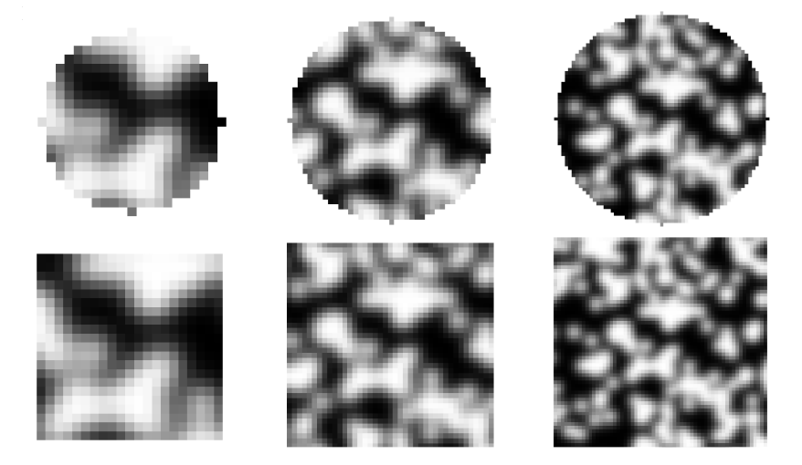

.. _Subset:

Subset
------

A subset is a small region within an image defined via a coordinate and a template. Localised warp between an image pair is considered by applying warp to a subset iteratively according to a particular PIV algorithm.

Templates
^^^^^^^^^

Templates are defined by size and shape. In `geopyv` templates can be square or circular. Below are some examples:

Shape Functions
^^^^^^^^^^^^^^^

The zeroth-order subset warp function is the simplest warp function, that is only used in `geopyv` for the initial guess in the higher order warp function based methods:

.. math::
    :label: W_0

    \mathbf{W}_{\mathbf{0}}\left(x, y ; \mathbf{p}_{1}\right) = \left[\begin{array}{l}
    x^{\prime} \\
    y^{\prime}
    \end{array}\right] = \left[\begin{array}{ccc}
    x \\
    y
    \end{array}\right] + \left[\begin{array}{l}
    u \\
    v
    \end{array}\right]

The warp parameter vector for a zeroth-order warp function is then:

.. math::
    :label: p_0

    \mathbf{p}_{0}=\left(u, v\right)^{T}

Displacement gradients are added to generate a first-order subset warp function:

.. math::
    :label: W_1

    \mathbf{W}_{\mathbf{1}}\left(x, y ; \mathbf{p}_{1}\right) = \left[\begin{array}{l}
    x^{\prime} \\
    y^{\prime}
    \end{array}\right] = \left[\begin{array}{l}
    x \\
    y
    \end{array}\right] + \left[\begin{array}{ccc}
    u_{x} & u_{y} & u \\
    v_{x} & v_{y} & v
    \end{array}\right]\left[\begin{array}{l}
    \Delta x \\
    \Delta y \\
    1
    \end{array}\right]

where :math:`\Delta x = (x - x_{c})` and :math:`\Delta  y = (y - y_{c})` are the local coordinates where :math:`(x_{c}, y_{c})` are the coordinates of the centre of the subset and :math:`(x, y)` are the coordinates of the point of interest. The corresponding warp parameter vector is:

.. math::
    :label: p_1

    \mathbf{p}_{1}=\left(u, v, u_{x}, v_{x}, u_{y}, v_{y}\right)^{T}

Higher order terms are added to generate the second-order subset warp function:

.. math::
    :label: W_2

    \mathbf{W}_{2}\left(x, y ; \mathbf{p}_{2}\right) = \left[\begin{array}{l}
    x^{\prime} \\
    y^{\prime}
    \end{array}\right] = \left[\begin{array}{l}
    x \\
    y
    \end{array}\right] + \left[\begin{array}{cccccc}
    \frac{1}{2} u_{x x} & u_{x y} & \frac{1}{2} u_{y y} & u_{x} & u_{y} & u \\
    \frac{1}{2} v_{x x} & v_{x y} & \frac{1}{2} v_{y y} & v_{x} & v_{y} & v
    \end{array}\right]\left[\begin{array}{c}
    \Delta x^{2} \\
    \Delta x \Delta y \\
    \Delta y^{2} \\
    \Delta x \\
    \Delta y \\
    1
    \end{array}\right]

for which the warp parameter vector is:

.. math::
    :label: p_2

    \mathbf{p}_{2}=\left(u, v, u_{x}, v_{x}, u_{y}, v_{y}, u_{x x}, v_{x x}, u_{x y}, v_{x y}, u_{y y}, v_{y y}\right)^{T}

Throughout the remainder of this documentation :math:`f(\mathbf{W}{(x, y; \mathbf{p})})` represents the intensity of the coordinate :math:`(x, y)` in the image :math:`f` when a warp function :math:`\mathbf{W}` is applied, with parameters defined by the warp parameter vector :math:`\mathbf{p}`.

.. todo::

    - Add examples of first and second order warp functions applied to a subset.

Subset quality metrics
^^^^^^^^^^^^^^^^^^^^^^

The required size of a subset depends strongly on the contrast of the texture encapsulated within. Two metrics are computed automatically on a subset level by `geopyv` to assist with assessing both general image quality and appropriate subset size: the Sum of Square of Subset Intensity Gradients (SSSIG) and the standard deviation of subset pixel intensities.

Sum of Square of Subset Intensity Gradients (SSSIG)
"""""""""""""""""""""""""""""""""""""""""""""""""""

The Sum of Square of Subset Intensity Gradients (SSSIG) is a subset texture quality measure proposed by :cite:t:`pan2008study` that is derived from the image gradients:

.. math::
    :label: nabla_f

    \nabla f = \left( \nabla f_{x}, \nabla f_{y} \right)

The directional gradients :math:`\nabla f_{x}` and :math:`\nabla f_{y}` can be computed by taking the partial derivatives of the function used to perform image intensity interpolation, which is the equivalent of performing the following multiplications using the :math:`\mathbf{Q} \cdot \mathbf{C} \cdot \mathbf{Q}^T` matrix:

.. math::
    :label: nabla_f_x

    \nabla f_{x} = \left[\begin{array}{llllll}
    1 & \delta y & \delta y^2 & \delta y^3 & \delta y^4 & \delta y^5
    \end{array}\right] \cdot \mathbf{Q} \cdot \mathbf{C}_{n(\lfloor x\rfloor-2:\lfloor x\rfloor+3,\lfloor y\rfloor-2:\lfloor y\rfloor+3)} \cdot \mathbf{Q}^{\mathbf{T}} \cdot\left[\begin{array}{c}
    0 \\
    1 \\
    0 \\
    0 \\
    0 \\
    0 \\
    \end{array}\right]

.. math::
    :label: nabla_f_y

    \nabla f_{y} = \left[\begin{array}{llllll}
    0 & 1 & 0 & 0 & 0 & 0
    \end{array}\right] \cdot \mathbf{Q} \cdot \mathbf{C}_{n(\lfloor x\rfloor-2:\lfloor x\rfloor+3,\lfloor y\rfloor-2:\lfloor y\rfloor+3)} \cdot \mathbf{Q}^{\mathbf{T}} \cdot\left[\begin{array}{c}
    1 \\
    \delta x \\
    \delta x^2 \\
    \delta x^3 \\
    \delta x^4 \\
    \delta x^5 \\
    \end{array}\right]

In this implementation an estimate of :math:`SSSIG` is computed by averaging the horizontal and vertical image intensity gradients:

.. math::
    :label: SSSIG

    SSSIG \approx \sum_{(x, y) \in n} \frac{1}{2}\left[\left(\nabla f_{x}\right)^{2}+\left(\nabla f_{y}\right)^{2}\right]

where :math:`n` is the set of coordinates that comprise the subset.

.. note::

    Values of :math:`SSSIG > 1 \cdot 10^5` are indicative of sufficient subset size and contrast according to :cite:t:`stanier2016vermiculate`.

Standard deviation of subset pixel intensities
""""""""""""""""""""""""""""""""""""""""""""""

The standard deviation of the subset pixel intensities, :math:`\sigma_{s}`, after :cite:t:`stanier2013improved`, is calculated as follows:

.. math::
    :label: sigma_s

    \sigma_{s} = \sqrt{\sum_{(x, y) \in n} \frac{\left(f(\mathbf{W}(x, y; \mathbf{0}))-\bar{f}\right)^{2}}{|n|}}

where :math:`f{(\mathbf{W}(x, y; \mathbf{0}))}` is the intensity of the coordinate :math:`(x, y)` after application of a null warp function for each of the set of :math:`n` coordinates that comprise the subset, and :math:`\bar{f}` is the mean subset pixel intensity:

.. math::
    :label: bar_f

    \bar{f} = \sum_{(x, y) \in n} \frac{f(\mathbf{W}(x, y; \mathbf{0}))}{|n|}\\

.. note::

    Values of :math:`\sigma_{s} > 15` are indicative of optimal seeding according to  :cite:t:`stanier2016vermiculate`.

Correlation coefficient
^^^^^^^^^^^^^^^^^^^^^^^

Various measures of correlation are used within `geopyv`, including Normalised Cross-Correlation (NCC), Zero-Normalised Sum of Squared Differences (ZNSSD) and Zero-Normalised Cross-Correlation (ZNCC).

Normalised Cross-Correlation
""""""""""""""""""""""""""""

The Normalised Cross-Correlation (NCC) criteria :math:`C_{NCC}` is defined as:

.. math::
    :label: C_NCC

    C_{NCC} = \frac{\sum_{(x, y) \in n} \left( f{(\mathbf{W}(x, y; \mathbf{0}))} \cdot g{(\mathbf{W}(x, y; \mathbf{p}))} \right)}{\sqrt{\sum_{(x, y) \in n} f{(\mathbf{W}(x, y; \mathbf{0}))}^{2} \cdot \sum_{(x, y) \in n} g{(\mathbf{W}(x, y; \mathbf{p}))}^{2}}}

where :math:`f_{(x, y; \mathbf{0})}` and :math:`g_{(x, y; \mathbf{p})}` are the image intensity at the coordinate :math:`(x,y)` for the reference subset and the target subset after application of a warp function :math:`\mathbf{W}` with deformation parameters as defined by the vector :math:`\mathbf{p}`. Values of :math:`C_{NCC}` fall in the range of 0 (no correlation) to 1 (perfect correlation).

Zero-Normalised Sum of Squared Differences
""""""""""""""""""""""""""""""""""""""""""

The Normalised Cross-Correlation coefficient :math:`C_{NCC}` is computationally expensive to determine and sensitive to mean changes in image brightness. The zero-normalised sum of squared differences :math:`C_{ZNSSD}` is more robust to mean changes in image brightness and is considerably cheaper to compute. It is defined as follows:

.. math::
    :label: C_ZNSSD

    C_{ZNSSD} = \sum_{(x, y) \in n} \left[ \frac{f{(\mathbf{W}(x, y; \mathbf{0}))}-\bar{f}}{\Delta f} - \frac{g{(\mathbf{W}(x, y; \mathbf{p}))}-\bar{g}}{\Delta g} \right]^2

where :math:`f{(\mathbf{W}(x, y; \mathbf{0}))}` and :math:`g{(\mathbf{W}(x, y; \mathbf{p}))}` are the image intensity in the reference image :math:`f` and the target image :math:`g`, for a coordinate :math:`(x, y)` in the set of :math:`n` coordinates that comprise the subset, when the warp function :math:`\mathbf{W}` is applied with deformation parameters as defined by the vector :math:`\mathbf{p}`. The quantities :math:`\bar{f}` and :math:`\bar{g}`, are the mean subset pixel intensities:

.. math::
    :label: bar_f_g

    \bar{f} = \sum_{(x, y) \in n} \frac{f{(\mathbf{W}(x, y; \mathbf{0}))}}{|n|}\\
    \bar{g} = \sum_{(x^{\prime}, y^{\prime}) \in n} \frac{g{(\mathbf{W}(x, y; \mathbf{p}))}}{|n|}

The quantities :math:`\Delta f` and :math:`\Delta g` are calculated as follows:

.. math::
    :label: Delta_f_g

    \Delta f = \sqrt{ \sum_{(x, y) \in n} \left( f{(\mathbf{W}(x, y; \mathbf{0}))} - \bar{f} \right)^2}\\
    \Delta g = \sqrt{ \sum_{(x, y) \in n} \left( g{(\mathbf{W}(x, y; \mathbf{p}))} - \bar{g} \right)^2}

Values for the zero-normalised sum of squared differences :math:`C_{ZNSSD}` fall in the range of 2 (no correlation) to 0 (perfect correlation).

Zero-Normlised Cross-Correlation
""""""""""""""""""""""""""""""""

The zero-normalised cross-correlation coefficient :math:`C_{ZNCC}` can be determined from the zero-normalised sum of squared differences
:math:`C_{ZNSSD}` as follows:

.. math::
    :label: C_ZNCC

    C_{ZNCC} = 1 - \left( \frac{C_{ZNSSD}}{2} \right)

as proven analytically by :cite:t:`pan2010equivalence`. The values of the zero-normalised cross-correlation coefficient :math:`C_{ZNCC}`
fall in the range of 0 (no correlation) to 1 (perfect correlation).

.. todo::

    - Add example illustrating robustness of zero-normalised methods to global lighting shifts.

Initial guess
^^^^^^^^^^^^^

The initial guess subset size is a square of side length :math:`s` such that:

.. math::
    :label: initial_s

    s = \sqrt{n}

where :math:`n` is the set of pixels that comprise the subset template. The position of the subset in the target image is computed to the
nearest ineteger pixel using the Normalised Cross-Correlation (NCC) criteria, :math:`C_{NCC}`. The initial guess method is a zero'th order
technique (i.e. rigid body translation), therefore the difference between the reference subset coordinates :math:`(x, y)` and the target
subset coordinates :math:`(x^{\prime}, y^{\prime})` that produces the maximum value of :math:`C_{NCC}` denotes the initial guess of the warp
function parameters :math:`u` and :math:`v`.

Iterative Solution Methods
^^^^^^^^^^^^^^^^^^^^^^^^^^

Inverse Compositional Gauss-Newton (ICGN) Method
""""""""""""""""""""""""""""""""""""""""""""""""

The Inverse Compositional Gauss-Newton method is the default approach used in `geopyv`, primarily because the majority of computational
operations are performed on the reference subset, remain constant through the iterative solution process, and so can be precomputed.
The incremental warp :math:`\Delta \mathbf{p}` is applied to the reference subset, hence the Zero Normalised Sum of Square Differences
(ZNSSD) correlation coefficient can be defined as:

.. math::
    :label: ICGN_ZNSSD

    C_{ZNSSD}(\Delta \mathbf{p}) = \sum_{(x, y) \in n} \left[ \frac{f{(\mathbf{W}(x, y; \Delta \mathbf{p}))}-\bar{f}}{\Delta f} - \frac{g{(\mathbf{W}(x, y; \mathbf{p}))}-\bar{g}}{\Delta g} \right]^2

A first-order Taylor series expansion yields:

.. math::
    :label: ICGN_Taylor

    C_{ZNSSD}(\Delta \mathbf{p}) = \sum_{(x, y) \in n} \left[\frac{f(\mathbf{W}(x, y ; 0))+\nabla f(\frac{\partial \mathbf{W}}{\partial \mathbf{p}}) \Delta \mathbf{p}-\bar{f}}{\Delta f}-\frac{g(\mathbf{W}(x, y ; \mathbf{p}))-\bar{g}}{\Delta g}\right]^{2}

where :math:`\nabla f` is the intensity gradient in the :math:`x` and :math:`y` directions:

.. math::
    :label: ICGN_nabla_f

    \nabla f = \left( \nabla f_{x}, \nabla f_{y} \right)

where :math:`\nabla f_{x}` and :math:`\nabla f_{y}` are approximated using bi-quintic B-spline image intensity interpolation as outlined previously, :math:`\frac{\partial \mathbf{W}}{\partial \mathbf{p}}` is the Jacobian of the warp function, and :math:`\Delta f` and :math:`\Delta g` are also as previously defined. The products of the image gradients and the Jacobian matrix are often referred to as the `steepest descent images`. For a first order subset:

.. math::
    :label: ICGN_dW_dp_1

    \frac{\partial \mathbf{W}_{1}}{\partial \mathbf{p}_{1}}=\left[\begin{array}{llllll}
    1 & 0 & \Delta x & 0 & \Delta x & 0 \\
    0 & 1 & 0 & \Delta y & 0 & \Delta y
    \end{array}\right]

For a second order subset:

.. math::
    :label: ICGN_dW_dp_2

    \frac{\partial \mathbf{W}_{2}}{\partial \mathbf{p}_{2}}=\left[\begin{array}{cccccccccccc}
    1 & 0 & \Delta x & 0 & \Delta x & 0 & \frac{1}{2} \Delta x^{2} & 0 & \Delta x \Delta y & 0 & \frac{1}{2} \Delta y^{2} & 0 \\
    0 & 1 & 0 & \Delta y & 0 & \Delta y & 0 & \frac{1}{2} \Delta x^{2} & 0 & \Delta x \Delta y & 0 & \frac{1}{2} \Delta y^{2}
    \end{array}\right]

The magnitude of :math:`\Delta \mathbf{p}` can then be solved via the least squares method:

.. math::
    :label: ICGN_Delta_p

    \Delta \mathbf{p}=-\mathbf{H}^{-1} \sum_{(x, y) \in n} \left\{\left[\nabla f\left(\frac{\partial \mathbf{W}}{\partial \mathbf{p}}\right)\right]^{T}\left[f(\mathbf{W}(x, y ; 0))-\bar{f} - \frac{\Delta f}{\Delta g} (g(\mathbf{W}(x, y ; \mathbf{p}))-\bar{g})\right]\right\}

where :math:`\mathbf{H}` is (the Gauss-Newton approximation to) the Hessian matrix:

.. math::
    :label: ICGN_Hessian

    \mathbf{H} = \sum_{(x, y) \in n}  \left\{\left[\nabla f\left(\frac{\partial \mathbf{W}}{\partial \mathbf{p}}\right)\right]^{T}\left[\nabla f\left(\frac{\partial \mathbf{W}}{\partial \mathbf{p}}\right)\right]\right\}

In the ICGN method, the Hessian matrix :math:`\mathbf{H}` is constant because the intensity gradient :math:`\nabla f` and Jacobian of the warp function :math:`\frac{\partial \mathbf{W}}{\partial \mathbf{p}}` are independent of the target subset. The updated warp function is then computed as follows:

.. math::
    :label: ICGN_warp_update

    \mathbf{W}(x, y ; \mathbf{p}) \leftarrow \mathbf{W}(x, y ; \mathbf{p}) \circ \mathbf{W}^{-1}(x, y ; \Delta \mathbf{p})

Since the warp function :math:`\mathbf{W}` must be inverted in order to solve :math:`\Delta \mathbf{p}`, the warp functions must be converted to a homogenous form. The expanded first-order homogenous form is trivial:

.. math::
    :label: ICGN_W_1

    \mathbf{W}_{\mathbf{1}}\left(x, y ; \mathbf{p}_{1}\right)=\left[\begin{array}{ccc}
    1+u_{x} & u_{y} & u \\
    v_{x} & 1+v_{y} & v \\
    0 & 0 & 1
    \end{array}\right]

The expanded second-order homogenous form requires additional terms, which were derived by :cite:t:`gao2015high`:

.. math::
    :label: ICGN_W_2

    \mathbf{W}_{\mathbf{2}}\left(x, y ; \mathbf{p}_{2}\right)=\left[\begin{array}{cccccc}
    1+S_{1} & S_{2} & S_{3} & S_{4} & S_{5} & S_{6} \\
    S_{7} & 1+S_{8} & S_{9} & S_{10} & S_{11} & S_{12} \\
    S_{13} & S_{14} & 1+S_{15} & S_{16} & S_{17} & S_{18} \\
    \frac{1}{2} u_{x x} & u_{x y} & \frac{1}{2} u_{y y} & 1+u_{x} & u_{y} & u \\
    \frac{1}{2} v_{x x} & v_{x y} & \frac{1}{2} v_{y y} & v_{x} & 1+v_{y} & v \\
    0 & 0 & 0 & 0 & 0 & 1
    \end{array}\right]

where:

.. math::

    \begin{array}{ll}
    S_{1}=2 u_{x}+u_{x}^{2}+u u_{x x} & S_{2}=2 u u_{x y}+2\left(1+u_{x}\right) u_{y} \\
    S_{3}=u_{y}^{2}+u u_{y y} & S_{4}=2 u\left(1+u_{x}\right) \\
    S_{5}=2 u u_{y} & S_{6}=u^{2} \\
    S_{7}=\frac{1}{2}\left[v u_{x x}+2\left(1+u_{x}\right) v_{x}+u v_{x x}\right] & S_{8}=u_{y} v_{x}+u_{x} v_{y}+v u_{x y}+u v_{x y}+v_{y}+u_{x} \\
    S_{9}=\frac{1}{2}\left[v u_{y y}+2 u_{y}\left(1+v_{y}\right)+u v_{y y}\right] & S_{10}=v+v u_{x}+u v_{x} \\
    S_{11}=u+v u_{y}+u v_{y} & S_{12}=u v \\
    S_{13}=v_{x}^{2}+v v_{x x} & S_{14}=2 v v_{x y}+2 v_{x}\left(1+v_{y}\right) \\
    S_{15}=2 v_{y}+v_{y}^{2}+v v_{y y} & S_{16}=2 v v_{x} \\
    S_{17}=2 v\left(1+v_{y}\right) & S_{18}=v^{2}
    \end{array}

Forward Additive Gauss-Newton (FAGN) Method
"""""""""""""""""""""""""""""""""""""""""""

The Forward Additive Gauss-Newton method is an alternative approach used in `geopyv`. It is a classical approach in DIC, but is not the default here primarily because the majority of computational operations are performed on the target subset, such that they require recallculation for every iteration. This is computationally far more expensive than the ICGN approach, but in all other ways the approaches are effectively equivalent. The incremental warp :math:`\Delta \mathbf{p}` is applied to the target subset, hence the Zero Normalised Sum of Square Differences (ZNSSD) correlation coefficient can be defined as:

.. math::
    :label: FAGN_ZNSSD

    C_{ZNSSD}(\Delta \mathbf{p}) = \sum_{(x, y) \in n} \left[ \frac{f{(\mathbf{W}(x, y; \mathbf{0}))}-\bar{f}}{\Delta f} - \frac{g{(\mathbf{W}(x, y; \mathbf{p} + \Delta \mathbf{p}))}-\bar{g}}{\Delta g} \right]^2

A first-order Taylor series expansion yields:

.. math::
    :label: FAGN_Taylor

    C_{ZNSSD}(\Delta \mathbf{p}) = \sum_{(x, y) \in n} \left[\frac{f(\mathbf{W}(x, y ; \mathbf{0}))-\bar{f}}{\Delta f} - \frac{g(\mathbf{W}(x, y ; \mathbf{p}))+\nabla g\left(\frac{\partial \mathbf{W}}{\partial \mathbf{p}}\right) \Delta \mathbf{p}-\bar{g}}{\Delta g}\right]^{2}

where :math:`\nabla g` is the intensity gradient in the :math:`x` and :math:`y` directions:

.. math::
    :label: FAGN_sdi

    \nabla g = \left( \nabla g_{x}, \nabla g_{y} \right)

where :math:`\nabla g_{x}` and :math:`\nabla g_{y}` are approximated using bi-quintic B-spline image intensity interpolation as outlined previously, :math:`\frac{\partial \mathbf{W}}{\partial \mathbf{p}}` is the Jacobian of the warp function, and :math:`\Delta f` and :math:`\Delta g` are also as previously defined. The products of the image gradients and the Jacobian matrix are often referred to as the `steepest descent images`. For a first order subset:

.. math::
    :label: FAGN_dW_dp_1

    \frac{\partial \mathbf{W}_{1}}{\partial \mathbf{p}_{1}}=\left[\begin{array}{llllll}
    1 & 0 & \Delta x & 0 & \Delta x & 0 \\
    0 & 1 & 0 & \Delta y & 0 & \Delta y
    \end{array}\right]

For a second order subset:

.. math::
    :label: FAGN_dW_dp_2

    \frac{\partial \mathbf{W}_{2}}{\partial \mathbf{p}_{2}}=\left[\begin{array}{cccccccccccc}
    1 & 0 & \Delta x & 0 & \Delta x & 0 & \frac{1}{2} \Delta x^{2} & 0 & \Delta x \Delta y & 0 & \frac{1}{2} \Delta y^{2} & 0 \\
    0 & 1 & 0 & \Delta y & 0 & \Delta y & 0 & \frac{1}{2} \Delta x^{2} & 0 & \Delta x \Delta y & 0 & \frac{1}{2} \Delta y^{2}
    \end{array}\right]

The magnitude of :math:`\Delta \mathbf{p}` can then be solved via the least squares method:

.. math::
    :label: FAGN_lsq

    \Delta \mathbf{p}=-\mathbf{H}^{-1} \sum_{(x, y) \in n} \left\{\left[\nabla g\left(\frac{\partial \mathbf{W}}{\partial \mathbf{p}}\right)\right]^{T}\left[ (f(\mathbf{W}(x, y ; 0))-\bar{f}) \frac{\Delta g}{\Delta f} - g(\mathbf{W}(x, y ; \mathbf{p}))-\bar{g}\right]\right\}

where :math:`\mathbf{H}` is (the Gauss-Newton approximation to) the Hessian matrix:

.. math::
    :label: FAGN_Hessian

    \mathbf{H} = \sum_{(x, y) \in n}  \left\{\left[\nabla g\left(\frac{\partial \mathbf{W}}{\partial \mathbf{p}}\right)\right]^{T}\left[\nabla g\left(\frac{\partial \mathbf{W}}{\partial \mathbf{p}}\right)\right]\right\}

Finally, the warp parameter vector is updated as follows:

.. math::
    :label: FAGN_warp_update

    \mathbf{p} \leftarrow \mathbf{p} + \Delta \mathbf{p}

Exit criteria
"""""""""""""

For a first order subset warp function the norm is:

.. math::
    :label: norm_1

    \|\Delta p\| = \left[ \Delta u^2 + \Delta v^2 + \left( \Delta u_{x}  s \right)^2 + \left( \Delta u_{y} s \right)^2 + \left( \Delta v_{x} s \right)^2 + \left( \Delta v_{y} s \right)^2 \right]^{1/2}

For a second order subset warp function the norm is:

.. math::
    :label: norm_2

    \begin{multline*}
    \|\Delta p\| = \Bigl[ \Delta u^2 + \Delta v^2 + \left( \Delta u_{x} s \right)^2 + \left( \Delta u_{y} s \right)^2 + \left( \Delta v_{x} s \right)^2 + \left( \Delta v_{y}  s \right)^2 \\
    + \left(0.5 \Delta u_{xx} s^2 \right)^2 + \left(0.5 \Delta u_{xy} s^2 \right)^2 + \left(0.5 \Delta u_{yy} s^2 \right)^2 + \left(0.5 \Delta v_{xx} s^2 \right)^2 + \left(0.5 \Delta v_{xy} s^2 \right)^2 + \left(0.5 \Delta v_{yy} s^2 \right)^2 \Bigr]^{1/2}
    \end{multline*}

where :math:`s` is the size of the subset (approximated generally as the square root of the number of pixels in the template). The iterative solution process is classed as convergent when the norm is less than a user-defined limit, otherwise the iterative solver is stopped if the number of iterations exceeds a user-defined limit.

.. note::

    A typical exit criteria for the norm used in the iterative computations is :math:`\|\Delta p\|_{max} = 1 \cdot 10^{-3}` and the  maximum number of iterations is :math:`15` and are the default arguments for all solve methods.
