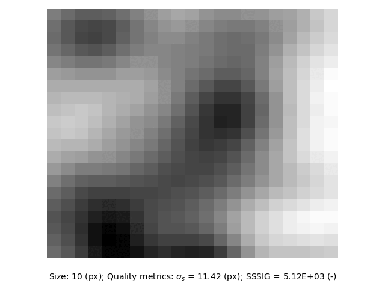

.. _Subset Tutorial:

Subset
======

The following tutorial showcases the functionality of the Subset class, which allows the displacement of a single point to be computed between a `reference` and `target` image pair.

Creating a subset
-----------------

Subsets can be created most simply as follows:

.. code-block:: python
   
    # Imports.
    import geopyv as gp

    # Create subset.
    subset = gp.subset.Subset()

This will generate prompts that will require you to select `f_img` (the `reference` image) and `g_img` (the `target` image) via the native file browser and to select a seed coordinate using a graphical user interface. This will also use the default circular subset template with a size (radius) of 50 pixels.

.. todo::

    Add gifs of image and coordinate selector gui.

Alternatively, the `Subset` object can be more precisely instantiated with some or all of the following arguments:

.. code-block:: python

    # Imports.
    import geopyv as gp
    import numpy as np

    # Load image objects.
    f_img = gp.image.Image("./path/to/reference_image.png")
    g_img = gp.image.Image("./path/to/target_image.png")

    # Coordinate.
    f_coord = np.array([1000,1000])

    # Template.
    template = gp.templates.Circle(100)

    # Subset instantiation options.
    subset = gp.subset.Subset(f_img=f_img, g_img=g_img, f_coord=f_coord, template=template)

Such an approach lends itself extremely well to scripting the analysis of many `geopyv` objects. Once a subset has been generated, it can be inspected using the inspect command:

.. code-block:: python

    # Inspect subset.
    subset.inspect()

This will generate the plot shown in :numref:`inspect_subset` showing the subset alongside its size and various image texture quality metrics, which allow the subset size to be manually optimised.

.. _inspect_subset:

    Plot generated by the inspect() method of the Subset class.

Optimising subset quality
^^^^^^^^^^^^^^^^^^^^^^^^^

Circular subsets are thought to exhibit reduced bias in the computation of displacement due them having equal radius in all directions. Nonetheless, square subsets are also available. :numref:`circle_subset_size` shows a circular subset of varying size from a kaolin clay model with black dyed sand seeding.  :numref:`square_subset_size` shows square subsets of varying size at the same location.

.. _circle_subset_size:

    Circular subsets varying from 10-100 pixels in size (radius).

.. _square_subset_size:

    Square subsets varying from 10-100 pixels in size (half width).

The subset quality metrics vary with subset size and you should aim to use the smallest subset size of sufficient quality. :cite:t:`stanier2016vermiculate` suggests values of :math:`\sigma_{s} = 15` and :math:`SSSIG > 1 \cdot 10^5`. These suggested thresholds are indicated in :numref:`subset_quality` indicating that the optimum subset size (when both metric targets are met) is around 50 pixels for both circular and square subsets. The small offset between the circular and square subset metrics is due to the square subset having ~127\% of the area of a circular subset of the same size. :math:`SSSIG` will continue to grow with increasing subset size, whereas :math:`\sigma_{s}` will tend to plateau.

.. _subset_quality:

    Subset quality metrics for typical circular and square subsets varying from 10-100 pixels in size (radius and half width, respectively).

Solving the subset
------------------

The subset displacement (and strain components) are solved by calling the solve() method:

.. code-block:: python

    # Solve.
    subset.solve()

This command uses default settings as given in :numref:`default_solve_subset`.

.. _default_solve_subset:

.. table:: Default subset solver settings.
    :align: center

    ======================== =========== 
    Setting                  Value
    ======================== ===========
    Method                   ICGN
    Warp Function            First-Order
    Max. Iterations          15
    Max. :math:`\Delta` Norm 1E-3
    Tolerance                0.7
    ======================== ===========

Custom settings can be passed to the solve() method as follows:

.. code-block:: python

    # Custom solver settings.
    success = subset.solve(method="FAGN", max_iterations=30, max_norm=1E-4, order=2, tolerance=0.9)

In this case the settings summarised in :numref:`custom_solve_subset` have been applied. This includes the classical Forward Additive Gauss-Newton algorithm, a second order warp function, a more stringent convergence tolerance, an increased maximum number of iterations, and a higher correlation coefficient tolerance. The `success` parameter returned is a boolean that indicates whether the subset has been solved within the specified correlation coefficient tolerance.

.. _custom_solve_subset:

.. table:: Custom subset solver settings.
    :align: center

    ======================== ============
    Setting                  Value
    ======================== ============
    Method                   FAGN
    Warp Function            Second-Order
    Max. Iterations          30
    Max. :math:`\Delta` Norm 1E-4
    Tolerance                0.9
    ======================== ============

The rate of convergence of the subset can be assessed using the convergence() method:

.. code-block:: python

    # Assess convergence.
    subset.convergence()

This will generate :numref:`convergence_subset` showing the iterative progression towards the convergence tolerance :math:`\Delta` Norm. In this instance the subset converges very rapidly.

.. _convergence_subset:

.. figure:: ../images/convergence_subset.png
    :width: 600
    :align: center

    Convergence plot generated by the convergence() method of the Subset class.

.. warning:: 

    A slow rate of convergence, or saturation of the number of iterations (i.e. iterations performed equal to the maximum specific iterations) indicates problems with the analysis.

Accessing the data
------------------

The subset data is stored in the `data` attribute as a dictionary with the following structure and types:

.. code-block:: python

    # Subset data attribute structure and types.
    data = {
        "type": "Subset",
        "solved": bool,
        "unsolvable": bool,
        "images": {
            "f_img": str,
            "g_img": str,
        },
        "position": {
            "x": float,
            "y": float,
        },
        "quality": {
            "SSSIG": float,
            "sigma_intensity": float,
        }
        "template": {
            "shape": str,
            "dimension": str,
            "size": int,
            "n_px": int,
        },
        "settings": {
            "method": str,
            "order": int,
            "max_norm": float,
            "max_iterations": int,
            "tolerance": float,
        },
        "results": {
            "u": float,
            "v": float,
            "p": np.ndarray,
            "history": np.ndarray,
            "iterations": int,
            "norm": float,
            "C_ZNCC": float,
            "C_ZNSSD": float,
        }
    }

The data can be accessed using the various nested dictionary keys, for example, to access the `p` vector of warp function parameters for the previously solved `Subset` instance we called `subset`, you would use the following command:

.. code:: python

    # Access and print `p` vector.
    p = subset.data["results"]["p"]
    print(p)

.. note:: 

    The next step is to create a mesh of subsets using the Mesh class.